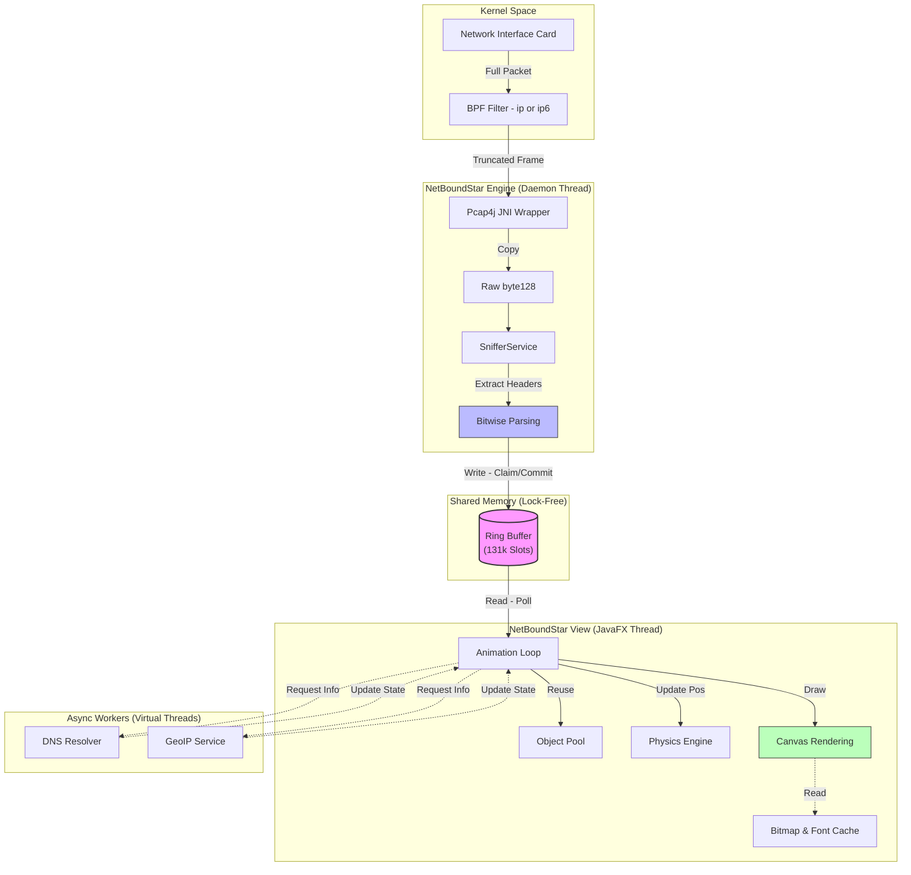

This is the translated and polished version of your `README.md` in English, maintaining the high-level technical tone and structural integrity.

---

# NetBoundStar

> **High-Performance Real-Time Network Telemetry Visualization**

NetBoundStar is a traffic engineering tool that transforms packet analysis into an intuitive visual experience. Utilizing astrophysical metaphors (constellations, gravity, repulsion), it dynamically organizes network connections, allowing for immediate identification of traffic patterns, DDoS attacks, connection anomalies, and geographic data distribution.

Unlike traditional table-based analyzers (such as Wireshark), NetBoundStar focuses on real-time **topology and density**, built on a modern Java 21 architecture optimized for zero-latency.

---

## Performance Engineering & Optimizations

NetBoundStar is engineered to operate on Gigabit links without causing Garbage Collector (GC) pauses or graphical interface jitter. The architecture follows **"Zero-Allocation"** principles across the execution Hot Path.

### 1. Lock-Free Architecture (Ring Buffer)
Instead of traditional queues (`BlockingQueue`), we utilize a fixed-size **Ring Buffer** (131,072 slots) with atomic cursors (`AtomicLong`).
*   **Backpressure:** Implements a *Drop-on-Full* strategy. If the UI cannot keep up with the ingress rate (e.g., during a 10Gbps burst), packets are silently dropped before entering the heap, preventing `OutOfMemoryError` and maintaining application responsiveness.
*   **Bridge:** The `TrafficBridge` acts as a shared memory bus between the Capture Thread (Producer) and the Rendering Thread (Consumer) without locking (`synchronized`).

### 2. Raw Byte Parsing (Bitwise Operations)
Most network libraries instantiate heavy objects (`IPv4Packet`, `TcpPacket`) for every frame. NetBoundStar eliminates this overhead:
*   **Optimized Sniffer:** The `SnifferService` reads the raw `byte[]` directly from the network interface.
*   **Bitwise Parsing:** IPv4/IPv6 headers are decoded using bit shifting (`<<`, `&`) and manual masking. This avoids intermediate object allocation just to read IPs and Ports.
*   **Intelligent Truncation:** `SNAPLEN` is set to 128 bytes. Only headers are copied from Kernel to User Space (JNI), drastically reducing memory copy overhead while preserving `originalLength` for accurate bandwidth statistics.

### 3. Object Pooling & Memory Management
*   **Event Reuse:** `PacketEvent` objects within the Ring Buffer are allocated only during initialization and reused indefinitely.
*   **Generational ZGC:** The application is tuned to run with ZGC (`-XX:+UseZGC`), ideal for managing high allocation rates of temporary byte arrays with sub-millisecond pauses.

### 4. High-Frequency JavaFX Rendering
*   **Bitmap Caching:** Text elements (IPs, Labels) are rendered to images (`WriteableImage`) once and cached. This avoids expensive glyph layout recalculations and font rasterization in every frame (60 FPS).
*   **State Batching:** The Canvas avoids unnecessary `Color` allocations and state changes, using `setGlobalAlpha` for transparency effects instead of deriving new color objects.
*   **Virtual Threads:** DNS resolutions and GeoIP lookups (IO-bound) are delegated to **Virtual Threads** (Project Loom), ensuring the rendering thread is never blocked by external network latency.

---

## System Architecture

The diagram below illustrates the data flow from the network card to the screen pixels, highlighting the optimization layers:



---

## Features

*   **Geographic Clustering:** Automatic grouping of nodes by country as traffic density increases.
*   **Integrated Geo-location:** Automatic origin country resolution using a built-in MaxMind database.
*   **Particle Physics:** A visual simulation where each packet is a particle and each host is a celestial body subject to attraction and repulsion forces.
*   **Real-time Metrics:** Monitoring of PPS (Packets Per Second), Upload/Download bandwidth, and protocol distribution (TCP/UDP/ICMP).
*   **Dynamic Configuration:** Adjust physics parameters, node lifetime, and visual sensitivity during runtime.

---

##  Requirements & Installation

### Prerequisites
*   **Java 21 LTS** (Required for Virtual Threads and Generational ZGC support).
*   **Maven 3.8+**.
*   **Libpcap/Npcap**:
    *   *Linux:* `sudo apt install libpcap-dev`
    *   *Windows:* [Npcap](https://npcap.com/) (Install in "WinPcap API-compatible Mode").

### Compilation

```bash
git clone https://github.com/your-user/netBoundStar.git
cd netBoundStar
mvn clean install
```

### Building the Executable JAR

First, build the complete project to generate the executable FAT JAR:

```bash
# From the project root directory
mvn clean package
```

This command:
- Compiles all modules (netBoundStar-core, netBoundStar-engine, netBoundStar-view, netBoundStar-app)
- Packages all dependencies into a single executable JAR
- Places the generated JAR at: `netBoundStar-app/target/netBoundStar-app-1.0.0-SNAPSHOT.jar`

### Execution

**Linux / macOS:**
```bash
# From the project root directory (after mvn clean package)
cd netBoundStar-app/target
sudo java -XX:+UseZGC -XX:+ZGenerational -jar netBoundStar-app-1.0.0-SNAPSHOT.jar
```

**Windows (Run as Administrator):**
```cmd
cd netBoundStar-app\target
java -XX:+UseZGC -XX:+ZGenerational -jar netBoundStar-app-1.0.0-SNAPSHOT.jar
```

#### Alternative: Using Maven Directly

```bash
# From the project root directory
mvn exec:java
```

This option allows testing without building the FAT JAR.

---

## JVM Flags Explained

The following JVM flags are recommended for optimal NetBoundStar performance:

| Flag | Purpose |
| :--- | :--- |
| `-XX:+UseZGC` | Enables the ZGC garbage collector (low-latency, optimized for high throughput) |
| `-XX:+ZGenerational` | Activates generational mode for ZGC (reduces pause times further) |
| `-XX:+UseStringDeduplication` | Reduces memory usage for duplicate strings (optional) |
| `-Dprism.order=d3d,es2` | (Windows) Prioritizes Direct3D for graphics rendering |
| `-Djavafx.animation.fullspeed=true` | Runs animation loop at maximum frequency (60 FPS) |

---

## Configuration

The `.netboundstar.config` configuration file is automatically generated in the user directory. Adjustable parameters include:

| Parameter | Description |
| :--- | :--- |
| `network.interface` | Interface name (e.g., eth0). If empty, it auto-detects. |
| `cluster.by.country` | `true` to group IPs by flag/country. |
| `physics.repulsion` | Repulsion force between nodes (prevents overlap). |
| `star.life` | Time in seconds a node remains visible without active traffic. |

---


## License

Distributed under the MIT License. See `LICENSE` for more information.

---
*Developed with a focus on high performance and data visualization.*
